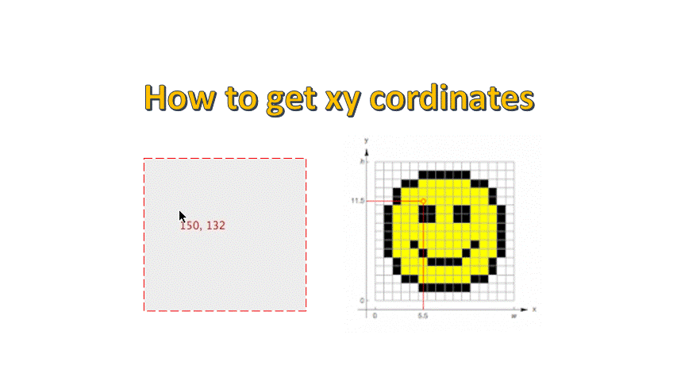
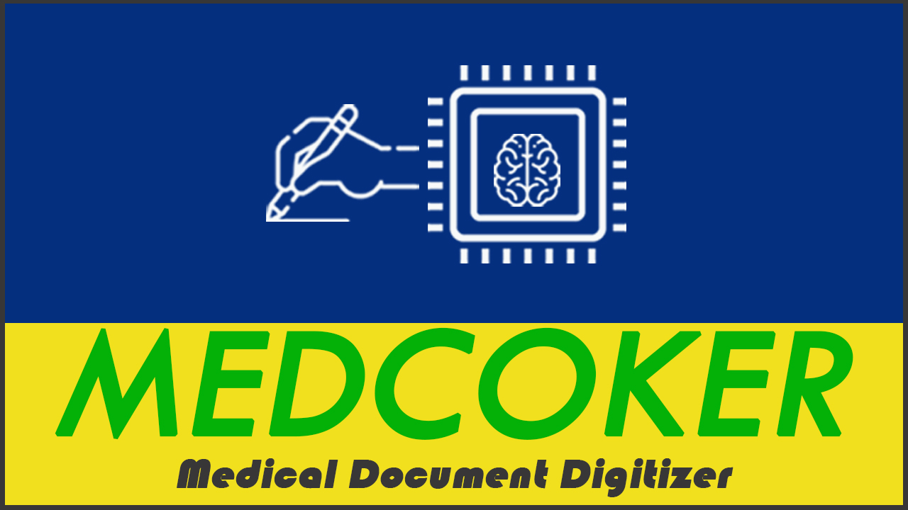

#  MEDOCKER

AI powered document digitizer

## Authors

- [@alxv](https://www.github.com/alxv)

Lauren Walker, Alexandar Vincent Paulraj
## Features

- Automatic identification of region of interest(ROI)
- Extract ROI
- Digitise handwritten text
- Store results in a CSV file

## Documentation

Handwritten documents must be digitised to improve storage, access, search, and analysis. Prior to the deep learning revolution, there was no clear path to achieve such a goal in a scalable manner.

Because of the variability of handwriting, automatic text detection and segmentation can be error-prone and frequently require custom preprocessing.

## Demo

### How to get XY cordinates for ROI

## Deployment

Download and open Medocker.ipynb in google colab.
Set GPU session.
Downolad sample images and corresponding template from this repository
Follow the instructions metioned in Medocker.ipynb file

### How to adapt this project for your work

1. Take your template/unfilled form (image)
2. Get cordinates for region of of interests in your template
3. Update them in medocker.ipynb file and follow the instructions in it
## Acknowledgements

Microsoft -trocr-large-handwritten & Huggingface

